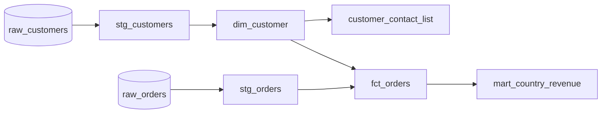

# dq-lineage-toolkit

[](https://github.com/DruvaSaiKumar/dq-lineage-toolkit/actions/workflows/ci.yml)

`dqkit` is a small tool for two questions data teams usually answer by hand:

1. Is the data any good? Checks are declared in YAML (nulls, duplicates, ranges, freshness, referential integrity, schema contracts, volume changes, custom SQL) and run on DuckDB. Results include severities, tolerances, sample bad rows and a run history.
2. What depends on what? Column-level lineage is parsed from dbt-style SQL models, with impact analysis ("what breaks if I change this column?"), tag propagation ("where does `pii` end up?") and a report of which columns have no check at all.

Everything runs on synthetic data.

## Try it

```bash
pip install -e .
dqkit demo
```

The demo builds a synthetic warehouse, runs the example models in dependency order, injects a known number of defects and runs every check. It writes a report, a Mermaid lineage diagram, a JSON lineage graph and a coverage report to `demo_output/`. It exits `1` because the checks find the defects, and `dqkit demo --clean` exits `0`.

## Quality checks

```yaml
dataset: stg_orders
table: stg_orders
checks:
  - { type: not_null, column: order_id }
  - { type: unique, columns: [order_id] }
  - { type: not_null, column: customer_id, severity: warn, max_failure_pct: 1 }
  - { type: accepted_values, column: status, values: [PENDING, PAID, SHIPPED, DELIVERED, CANCELLED] }
  - { type: range, column: amount, min: 0, max: 100000 }
  - { type: relationships, column: customer_id, to_table: stg_customers, to_column: customer_id }
  - { type: freshness, column: order_ts, max_age_hours: 48 }
  - { type: row_count_change, max_pct: 25 }      # compared with the previous recorded run
  - type: custom_sql
    name: discount_not_above_amount
    sql: "SELECT order_id FROM stg_orders WHERE amount >= 0 AND discount > amount"
```

| Check | Fails when |
|---|---|
| `not_null`, `accepted_values`, `range`, `regex` | a row breaks the rule (NULLs only count as violations for `not_null`) |
| `unique` | extra rows share a key (composite keys work) |
| `relationships` | a non-NULL value has no match in the parent table |
| `freshness` | the newest value is older than `max_age_hours` at `--now` |
| `row_count`, `row_count_change` | the count is out of bounds, or moved more than `max_pct` since the last run |
| `schema_contract` | a column is missing, has the wrong type family, or is unexpected (unless `allow_extra`) |
| `custom_sql` | the query returns rows |

Every check takes `severity: error|warn`, `max_failure_pct` (a tolerated share of failing rows, which is still reported) and returns up to `sample_size` violating rows. A check that can't run, because of a missing column or bad SQL, reports `ERROR` and the rest still run. Exit codes: `0` clean, `1` failed checks, `2` couldn't run.

### What the demo finds

`tests/test_demo_cli.py` asserts every count below.

| Injected defect | Injected | Reported by |
|---|---|---|
| Duplicate order rows | 5 | `unique:order_id` on `stg_orders` and `fct_orders` |
| Status outside the allowed list | 4 | `accepted_values:status` |
| Negative amounts | 8 | `range:amount` |
| Orders for unknown customers | 6 | `relationships:customer_id` |
| Orders with no customer | 12 | tolerated by `max_failure_pct: 1`; together with the orphans, 18 rows have a NULL country in `fct_orders` (warning) |
| Discount larger than amount | 10 | custom SQL on `stg_orders`, plus 10 negative `net_amount` rows in `fct_orders` |
| Invalid country / email | 3 / 4 | `accepted_values`, `regex` on `stg_customers` |
| Feed stopped two days early | n/a | `freshness:order_ts` |

Padded, mixed-case text was also injected into valid rows to show that staging cleans it up and the checks don't flag it.

## Lineage, impact and tags

```bash
dqkit lineage examples/models --sources examples/sources.yml --mermaid lineage.md --json lineage.json
dqkit impact  examples/models raw_orders.amount --sources examples/sources.yml
dqkit tags    examples/models --sources examples/sources.yml
```

Output of `impact`:

```
Changing raw_orders.amount can affect 4 column(s) in 3 model(s):

| Depth | Column | Relationship |
|---|---|---|
| 1 | stg_orders.amount | copy |
| 2 | fct_orders.amount | copy |
| 2 | fct_orders.net_amount | computed from it |
| 3 | mart_country_revenue.revenue | computed from it |
```



- sqlglot does the parsing. Each model column is traced through CTEs, joins and `SELECT *` to the upstream columns it comes from.
- An edge is a `copy` only if every step is a plain column reference. `WITH x AS (SELECT a * 2 AS b ...) SELECT b FROM x` is `computed`, and there is a test for it.
- Put `tags: [pii]` on source columns and `dqkit tags` lists every downstream column that carries the tag, and whether the value arrives as is or transformed. A transformation is never assumed to anonymize anything, so `lower(trim(email))` still counts.
- `ref()`, `source()` and `config()` are rendered. Any other Jinja is refused with an error naming the model, instead of being guessed at.

### Coverage

`dqkit coverage` matches quality configs to models and lists the columns nobody checks:

```
Column coverage by data-quality checks: 51.7%

| Model | Coverage | Columns without a check |
|---|---|---|
| stg_customers | 100.0% (5/5) | none |
| stg_orders | 83.3% (5/6) | discount |
| dim_customer | 0.0% (0/5) | no checks defined |
| customer_contact_list | 0.0% (0/3) | no checks defined |
| fct_orders | 42.9% (3/7) | customer_id, amount, discount, order_ts |
| mart_country_revenue | 66.7% (2/3) | orders |
```

`--fail-under N` turns it into a CI gate. `custom_sql` checks aren't tied to any column, which is why `discount` shows as unchecked even though a custom check reads it.

## Commands

| Command | Purpose |
|---|---|
| `dqkit check CONFIG... [--database F] [--history H] [--now T] [--report R] [--json J]` | run checks (wildcards are expanded by the tool, so it works in Windows shells) |
| `dqkit lineage MODELS [--sources S] [--mermaid F] [--json F]` | build the graph and write a diagram |
| `dqkit impact MODELS table.column` | everything built from a column |
| `dqkit tags MODELS --sources S` | where tagged columns end up |
| `dqkit coverage MODELS CONFIG... [--fail-under N]` | columns without a check |
| `dqkit demo [--clean]` | synthetic warehouse, defects, checks and reports |

## Limitations

- Lineage follows values, not filters. A column used only in a `WHERE` or `JOIN`, like `status` in `fct_orders`, isn't an edge. This is tested.
- Column lineage needs source schemas in `sources.yml`. Ambiguous columns without one are errors, and undeclared tables give a warning.
- Checks only run on DuckDB. The SQL is standard, but other engines would need an adapter. I haven't tried BigQuery, Snowflake or Databricks.
- Lineage has only been tried on the bundled models and some small test cases, not on a large real dbt project.
- `custom_sql` runs whatever SQL is in the config, so treat config files as trusted code. Table names are validated and identifiers and values are quoted, but it isn't a sandbox.
- Freshness needs a timestamp column, and the age is computed in Python against `--now`, not in SQL.

## Development

```bash
pip install -e .[dev]
pytest          # 59 tests
ruff check . && ruff format --check .
```

Design notes are in [docs/design-decisions.md](docs/design-decisions.md). MIT license.
